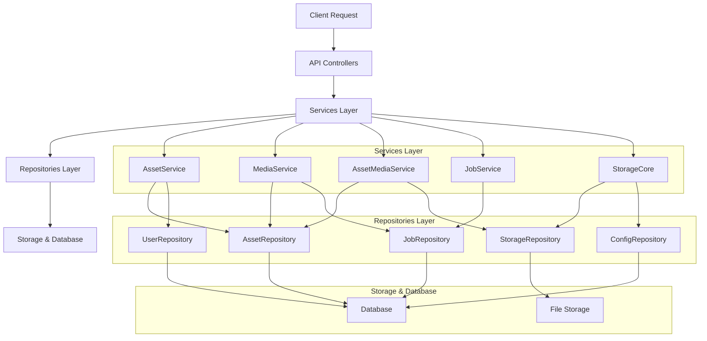
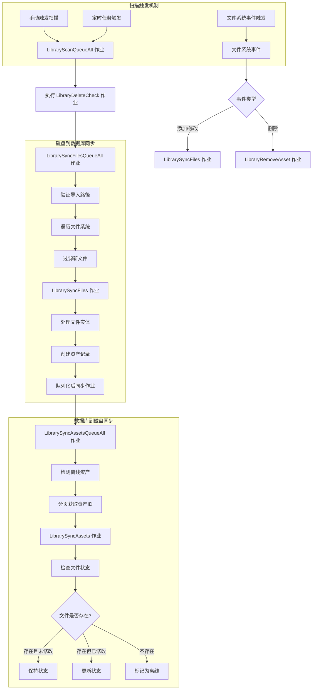
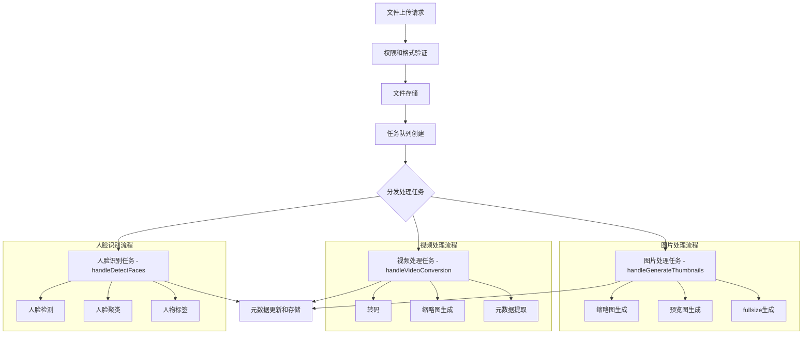
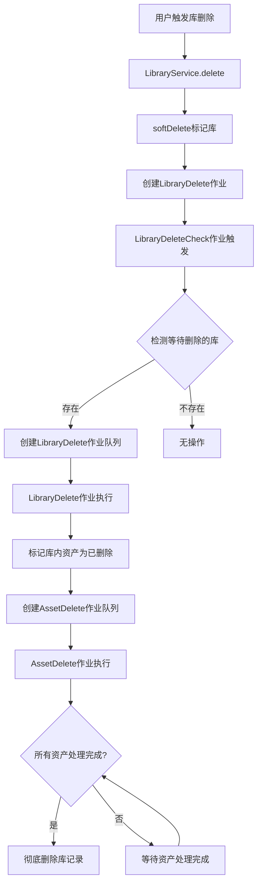

# Immich Server 说明

## 概述

Immich服务器是一个基于NestJS框架的后端应用，负责处理媒体文件上传、存储、处理和检索等核心功能。本文档详细介绍服务器的技术架构、文件处理流程等。

## 目录结构

Immich服务器采用模块化架构设计，主要包含以下核心目录：

```
server/
├── src/
│   ├── cores/           # 核心功能实现
│   ├── database/        # 数据库模型和查询
│   ├── dtos/            # 数据传输对象
│   ├── enums/           # 枚举类型定义
│   ├── middleware/      # 中间件
│   ├── repositories/    # 数据访问层
│   ├── services/        # 业务逻辑层
│   ├── utils/           # 工具函数
│   ├── app.module.ts    # 主模块
│   └── main.ts          # 应用入口
├── package.json
└── tsconfig.json
```

## 系统架构

### 模块结构

Immich服务器采用NestJS的模块化架构，主要包含以下核心模块：

1. **ApiModule** - 处理API请求和响应
2. **MicroservicesModule** - 处理后台任务和微服务功能
3. **ImmichAdminModule** - 管理后台功能
4. **BaseModule** - 所有模块的基础类，提供通用生命周期方法

### 核心组件关系



## 文件处理流程

### 文件扫描处理流程

Immich 服务器支持两种主要的文件扫描机制：实时文件监视和定时扫描。文件扫描流程负责发现外部库中的媒体文件并将其导入系统，同时也会检测已导入文件的状态变化。



### 文件扫描处理流程详解

1. **扫描触发机制**
   - **手动触发扫描**：用户通过界面或API手动启动库扫描，调用`queueScanAll`方法
   - **定时任务触发**：基于配置的cron表达式定期执行扫描，最终调用`queueScanAll`方法
   - **文件系统事件触发**：通过文件系统监视机制实时响应文件变化
   - 所有扫描触发最终都会启动`LibraryScanQueueAll`作业（由`handleQueueScanAll`处理器执行）和`LibraryDeleteCheck`作业（由`handleQueueCleanup`处理器执行）

2. **磁盘到数据库同步**
   - **导入路径验证**：由`handleQueueSyncFiles`处理器执行，验证库配置的导入路径是否有效且可访问
   - **文件系统遍历**：使用`storageRepository.walk`遍历所有有效导入路径
   - **文件过滤**：根据文件扩展名和排除模式过滤文件
   - **新文件处理**：通过`LibrarySyncFiles`作业（由`handleSyncFiles`处理器执行）对新发现的文件创建资产记录
   - **元数据提取**：队列化sidecar发现和元数据提取作业

3. **数据库到磁盘同步**
   - **离线资产检测**：由`handleQueueSyncAssets`处理器执行，检测不在导入路径或匹配排除模式的资产
   - **分页处理**：处理大量资产时使用分页机制避免性能问题
   - **文件状态检查**：通过`LibrarySyncAssets`作业（由`handleSyncAssets`处理器执行）验证资产文件是否存在且可访问
   - **状态更新**：根据检查结果更新资产状态（在线/离线/更新）

4. **LibrarySyncFiles作业详细功能**
   - **库有效性检查**：首先检查库是否存在且未被标记为删除
   - **文件处理**：对传入的文件路径列表并行调用`processEntity`方法处理每个文件
   - **实体处理**：`processEntity`方法负责：
     - 规范化文件路径
     - 获取文件统计信息
     - 计算路径校验和和文件内容哈希
     - 检查文件是否为加密文件并处理
     - 创建完整的资产数据结构
   - **批量导入**：将处理后的资产数据分块批量导入数据库（每批5000条）
   - **后续任务创建**：调用`queuePostSyncJobs`方法为新导入的资产创建sidecar发现任务，每个资产都会生成一个`SidecarCheck`作业（数据源标记为'upload'），sidecar发现作业会进一步触发元数据提取任务
   - **进度记录**：记录并输出导入进度信息

5. **文件系统事件处理**
   - **文件添加/修改**：由`handleSyncFiles`处理器执行，自动将新文件或修改的文件导入系统
   - **文件删除**：由`handleAssetRemoval`处理器执行，自动检测并标记删除的文件为离线

### 文件上传处理流程



### 库删除处理流程

Immich服务器实现了安全、有序的库删除机制，通过异步处理确保即使包含大量资产的库也能被正确清理，而不会阻塞系统或导致数据不一致。



### 库删除处理流程详解

1. **删除触发阶段**
   - 用户通过界面或API触发库删除操作
   - 系统调用`LibraryService.delete`方法
   - 该方法会先取消对库的文件系统监视（如启用）

2. **软删除阶段**
   - 调用`libraryRepository.softDelete`将库标记为软删除（设置`deletedAt`字段）
   - 创建`LibraryDelete`作业放入队列
   - 此时库进入"等待删除"状态，但尚未实际删除

3. **删除检查与执行**
   - `LibraryDeleteCheck`作业定期检查系统中是否有等待删除的库
   - 当发现等待删除的库时，为每个库创建`LibraryDelete`作业队列
   - `LibraryDelete`作业会将库中所有资产标记为已删除
   - 为每个资产创建`AssetDelete`作业进行后续清理

4. **最终删除阶段**
   - 当所有资产处理完成后，系统会彻底删除库本身
   - 这种设计确保了即使包含大量资产的库也能被安全、有序地删除

### 文件上传处理流程详解

1. **文件上传阶段**
   - 客户端发送文件上传请求
   - `AssetMediaService`验证文件类型和权限
   - 文件存储到临时位置
   - 创建资产记录到数据库

2. **媒体处理阶段**
   - 作业服务(`JobService`)将任务加入相应队列
   - 根据文件类型分发到不同处理队列：
     - 图片：缩略图生成队列
     - 视频：视频转码队列
   - 处理完成后更新数据库记录

3. **文件访问阶段**
   - 客户端请求媒体文件
   - 根据请求的尺寸返回相应媒体文件
   - 支持缩略图、预览图和原始文件访问

## 核心服务详解

### AssetMediaService

`AssetMediaService`负责处理媒体文件的上传、替换、下载等核心功能。

**主要功能**：
- 文件上传验证与处理
- 媒体文件访问控制
- 批量上传检查
- 重复文件检测

**关键方法**：
- `uploadAsset()` - 处理资产上传
- `replaceAsset()` - 替换现有资产
- `downloadOriginal()` - 下载原始文件
- `viewThumbnail()` - 查看缩略图
- `checkExistingAssets()` - 检查现有资产

### MediaService

`MediaService`负责媒体处理任务，包括缩略图生成、视频转码等核心媒体处理功能。

**主要功能**：
- 图片缩略图、预览图、全尺寸图生成
- 视频转码与优化
- 人脸识别缩略图生成
- 媒体元数据提取

**关键方法**：
- `handleGenerateThumbnail()` - 生成图片缩略图
- `handleVideoConversion()` - 处理视频转码
- `handleGeneratePersonThumbnail()` - 生成人物缩略图

### StorageCore

`StorageCore`管理文件存储位置、路径解析和文件移动操作，是文件存储管理的核心组件。

**主要功能**：
- 文件路径生成与管理
- 文件移动与重命名
- 目录创建与管理
- 文件完整性验证

**关键方法**：
- `getMediaLocation()` - 获取媒体存储位置
- `getImagePath()` - 获取图片文件路径
- `getEncodedVideoPath()` - 获取编码视频路径
- `moveFile()` - 移动文件
- `verifyNewPathContentsMatchesExpected()` - 验证文件完整性

### JobService

`JobService`负责管理后台任务队列，协调各种异步任务的执行。

**主要功能**：
- 任务队列创建与管理
- 定时任务调度
- 任务状态监控
- 并发控制

**关键方法**：
- `create()` - 创建新任务
- `handleCommand()` - 处理任务命令
- `getJobStatus()` - 获取任务状态
- `getAllJobsStatus()` - 获取所有任务状态

## 文件处理能力

### 图片处理

Immich服务器支持处理各种类型的图片文件，包括：

1. **缩略图生成**
   - 自动为所有图片生成不同尺寸的缩略图
   - 支持JPEG和WebP格式
   - 可配置质量和大小

2. **RAW文件处理**
   - 支持从RAW文件中提取嵌入的预览图
   - 自动检测和处理色彩空间
   - 支持各种RAW格式

3. **元数据提取**
   - 提取EXIF信息
   - 支持方向校正
   - 色彩空间识别

### 视频处理

Immich服务器提供强大的视频处理能力：

1. **视频转码**
   - 支持多种转码策略（Disabled, All, Required, Optimal, Bitrate）
   - 支持硬件加速（如可用）
   - 自动检测最佳转码参数
   - 自适应回退机制

2. **视频优化**
   - 分辨率调整
   - 比特率控制
   - 格式转换
   - 音频轨道处理

3. **视频缩略图生成**
   - 自动从视频中提取帧作为缩略图
   - 支持不同尺寸预览图

### 文件存储管理

Immich服务器提供全面的文件存储管理功能：

1. **文件组织**
   - 基于用户和资产ID的目录结构
   - 清晰的文件类型分类
   - 支持自定义存储路径模板

2. **文件完整性**
   - 校验和验证
   - 文件大小检查
   - 安全的文件移动操作

3. **存储优化**
   - 自动清理旧文件
   - 空目录删除
   - 存储空间使用跟踪

## 任务拆解

### 文件上传任务

1. **请求验证**
   - 验证用户权限
   - 检查文件类型
   - 验证存储空间配额

2. **文件处理**
   - 生成唯一文件名
   - 确定存储位置
   - 保存文件到存储系统

3. **数据库记录**
   - 创建资产记录
   - 更新用户使用情况
   - 触发处理事件

### 图片处理任务

1. **图像解码**
   - 读取原始图像
   - 处理方向信息
   - 应用色彩空间转换

2. **图像生成**
   - 生成缩略图
   - 生成预览图
   - 生成全尺寸图(如需要)
   - 计算Thumbhash

3. **元数据更新**
   - 保存生成的文件路径
   - 更新处理时间戳
   - 存储缩略图哈希

### 视频处理任务

1. **视频分析**
   - 检查视频流信息
   - 分析音频轨道
   - 确定转码需求

2. **视频转码**
   - 配置转码参数
   - 执行转码操作
   - 应用硬件加速

3. **结果处理**
   - 保存转码后的视频
   - 更新数据库记录
   - 清理临时文件

### 人物缩略图生成任务

1. **人脸区域提取**
   - 获取人脸边界框
   - 调整裁剪参数
   - 考虑图像缩放

2. **图像处理**
   - 解码源图像
   - 裁剪人脸区域
   - 生成标准尺寸缩略图

3. **更新人物记录**
   - 保存缩略图路径
   - 更新人物元数据

## 配置与扩展性

Immich服务器提供丰富的配置选项，包括：

1. **存储配置**
   - 媒体存储位置
   - 存储路径模板
   - 哈希验证设置

2. **处理配置**
   - 缩略图尺寸和质量
   - 视频转码策略
   - 硬件加速选项

3. **任务队列配置**
   - 队列并发度
   - 重试策略
   - 资源限制

## 总结

Immich服务器采用模块化、可扩展的架构设计，提供了强大的媒体文件处理能力。通过NestJS框架的依赖注入和模块化特性，实现了清晰的代码组织和职责分离。文件处理流程通过任务队列实现异步处理，保证了系统的响应性能和可靠性。同时，丰富的配置选项和优化策略，使得系统能够适应不同的部署环境和使用场景。
